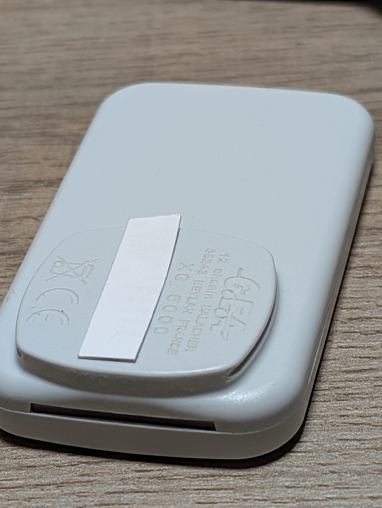
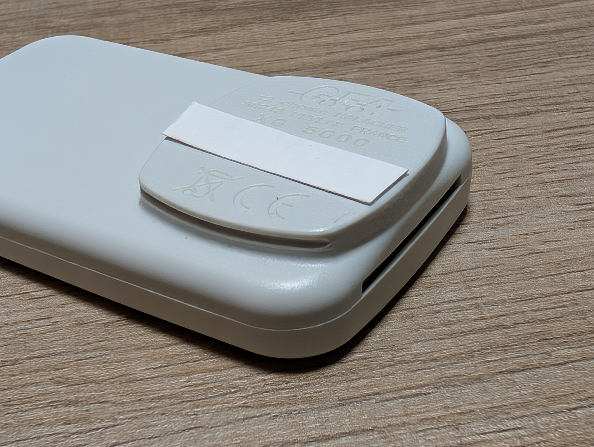

# ulys_clip
- V1.1: Improved -> More compact and tighter clip effect
- V1.0: Initial version

# Description
3D printed Clip to hold Ulys badge used in French motorways
the model seems to be GEA XG 5000 as written on the back but not sure.

# Pictures

